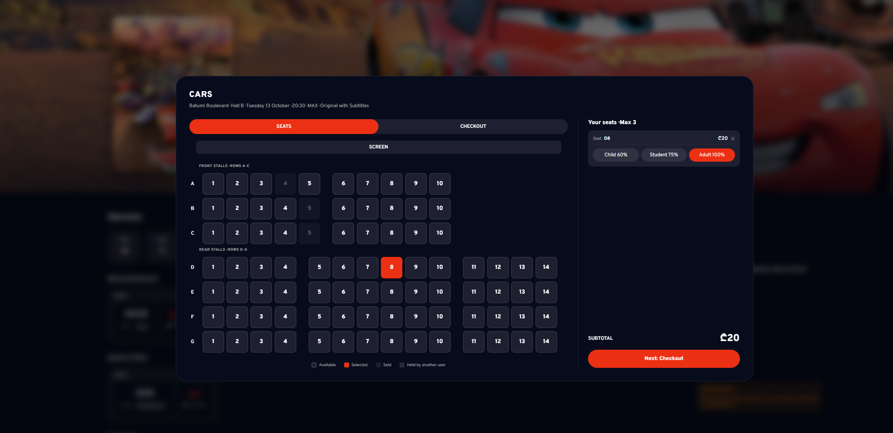

# Kino XII

A cinema booking website. Users can browse films and sessions, pick seats and buy tickets. It was built as part of the Redberry internship, following the Figma design and the provided API.




## Features

- **Authentication:** sign up (with optional avatar) and log in, with form validation and server error messages under each field. The session is restored on page refresh.
- **Home page:** featured films, now playing, coming soon, and a "Recently viewed" section.
- **Search:** live search with a short delay, so it doesn't send a request on every key press.
- **Sessions page:** filters (venue, date, format, language, time of day), sorting and pagination. Everything is kept in the URL, so refresh, back button and shared links keep the same view. Skeleton cards show while loading.
- **Movie page:** sessions for each day, grouped by venue and hall.
- **Booking:** seat map drawn from the API, up to 3 seats, a ticket type for each seat, a timed seat hold, checkout, and a confirmation screen.
- **Profile:** edit personal information. A complete profile is required to book.
- **My Tickets:** upcoming and past tickets, and refunds when the API allows them.

## Tech stack

- React
- React Router
- CSS Modules
- Vite
- [Anything else you used]

## Getting started

Requirements: Node.js [version] or newer.

```bash
git clone [repository url]
cd [project folder]
npm install
npm run dev
```

Then open http://localhost:5173.

The API address is set in `src/api.js` (`BASE_URL`).

To test a purchase, the payment is simulated. Any 16-digit card number with a future expiry works, for example `4242 4242 4242 4242`, `09/30`, `123`.

## Project structure

```
src/
  api.js          requests to the API (apiFetch adds the login token)
  context/        AuthContext (user, login, logout) and ModalContext
  pages/          HomePage, SessionsPage, MovieDetailsPage, ProfilePage
  components/     reusable parts (navbar, cards, filters, seat map...)
  modals/         login, sign up, booking
  styles/         CSS modules
```

## How it works

- **API data is the source of truth.** Prices, refund rules (`isRefundable`), profile completeness and the seat hold expiry come from the server, not from my own calculations.
- **Filters live in the URL,** so the page can be refreshed or shared without losing them.
- **Search is debounced,** and old requests are cancelled so slow results never replace newer ones.
- **Booking handles the failure cases:** a seat taken by someone else, an expired hold, an expired login, and validation errors.
- **Login:** the token is saved in `localStorage`, and the user is refreshed from `/me` when the app starts.

## Author

[Tornike ALtunashvili], [(https://github.com/TornikeALT?tab=repositories)]
